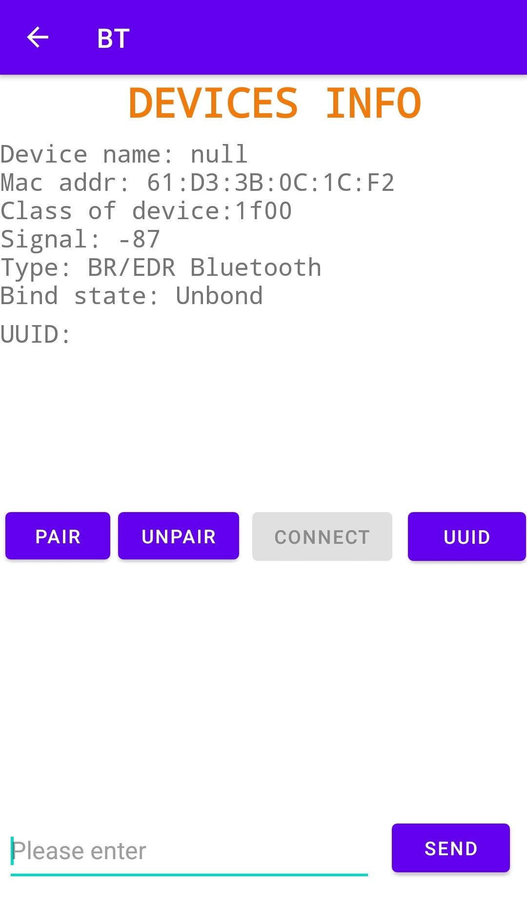

# BT项目：一个蓝牙串口助手

- 项目是一个Android的蓝牙串口项目。Android最低版本为7.1.1。

- 安装包下载链接 [BT.apk](https://github.com/nepleo/BT/blob/master/app/release/app-release.apk)

-  毕业设计进度 20%，加油！！！

- 示例图片

<table>
    <tr>
        <td >

</td>
        <td >

</td>
        <td >

</td>
    </tr>
</table>